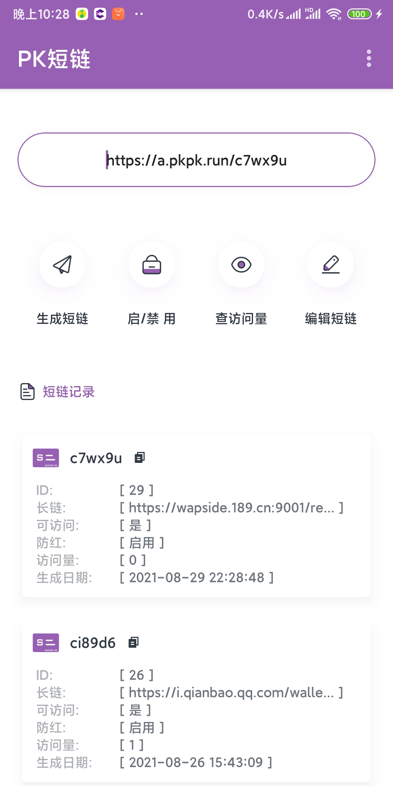
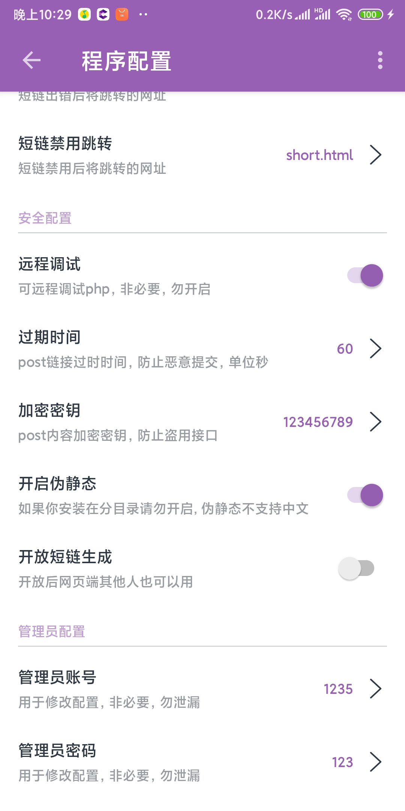
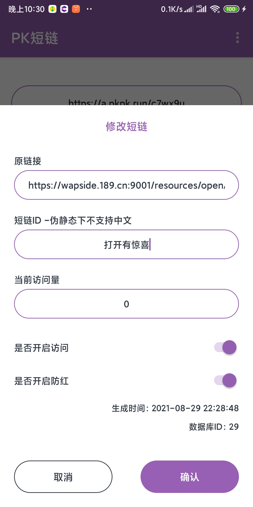

短链生成
==============
可生成短链，可关闭短链访问，亦可查看短链访问量。 
下载APP拥有完全控制权。 
有BUG，或功能上的建议 请留言

当前功能
---
> 1. `生成短链`
> 2. `启用/禁用 短链`
> 3. `查询访问量`
> 4. `QQ/微信 防红`
> 5. `自定义短链，支持中文, 伪静态下不支持`
> 6. `APP管理`

后续
---
> 后续更新伪静态下支持中文

预览
---
>[浏览地址](http://a.pkpk.run/)  
>[APP下载](.res/app.apk)

安装建议
---
> 1. `php 7.0 以上`
> 2. `php mysqli 支持`
> 3. `Mysql 5.5 以上`
> 4. `伪静态选择.htaccess`
> 5. `注意： 开启伪静态后请安装网址根目录`

效果图
---
`HTML`

|PC UI|移动UI|
|:---:|:---:|
|  |  | 

`Android`

|首页|配置|修改|
|:---:|:---:|:---:|
|  |  |  |

更新日志
---
>* 更新  2021-08-29
>* 版本 1.2
>1. 新增 APP（Android）
>2. 新增超级管理员
>3. 新增6个接口方法
>4. 新增伪静态
>5. 新增自定义短链
>6. 新增中文支持

>* 更新  2021-06-12
>* 版本 1.1
>1. 修复安装路径检测问题
>2. 修复自动创建数据库问题

>* 创建  2021-05-23
>* 版本 1.0
>1. 支持生成短链
>2. 支持启用禁用短链接
>3. 支持查询访问次数

By: Pikachu_WeChat
===
