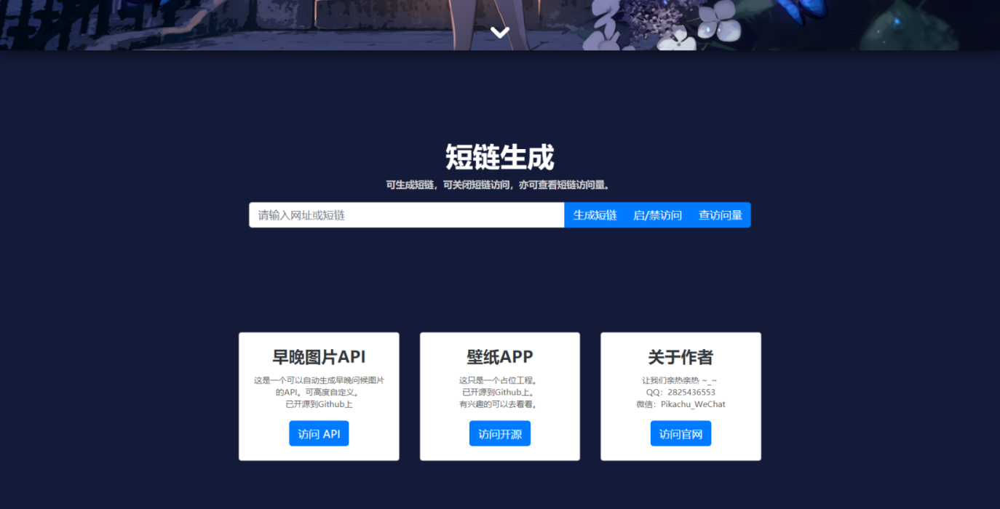

短链生成
==============
可生成短链，可关闭短链访问，亦可查看短链访问量。 
无需配置伪静态。

已完成功能
---
> 1. `生成短链`
> 2. `启用/禁用 短链`
> 3. `查询访问量`
> 4. `QQ/微信 防红`
> 5. `简单响应UI`

未完成功能
---
> 1. `登录未做`
> 2. `后台管理未做`

预览
---
>[浏览地址](http://pkpk.run/short/)

效果图
===
|PC UI|移动UI|
|:---:|:---:|
|  |  | 

By: Pikachu_WeChat
===
